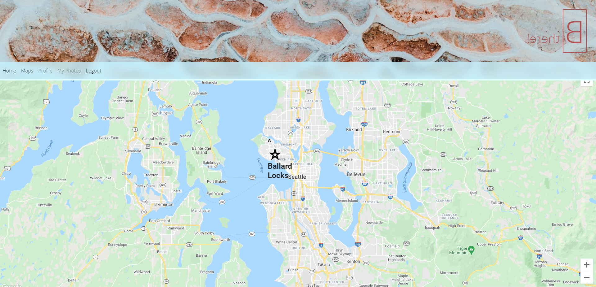

# project_3 - B There!

#### Table of Contents
* [About](#about-this-project)
    * [Description](#description)
    * [Built With](#built-with)
* [Usage](#usage)
* [Contributors](#contributors)

# About this Project

## Home Page

## Profile

## Map

## Description

B There is a Picture Sharing Social Media App which allows users to submit and share photos with descriptions to be seen by other users. The unique aspect of this app is that their is a daily event in the users local city. Users can go to this event and submit "Event Photos" for daily points and rewards. 

## Built With

* [Javascript](https://www.javascript.com/)
* [CSS](https://www.w3.org/Style/CSS/)
* [HTML5](https://html.com/html5/)
* [Node.js](https://nodejs.org/en/)
* [Sequelize](https://sequelize.org/)
* [Express.js](https://expressjs.com/)
* [Bcrypt](https://www.npmjs.com/package/bcrypt)
* [React.js](https://reactjs.org/)

# Usage

Click the link to our webpage: <https://lit-tundra-22638.herokuapp.com>

# Contributors

* [Eric Malpass](https://github.com/EricMalpass)
* [ShaoGe](https://github.com/sg3606)
* [Samuel Oberg](https://github.com/sosoberg)
* [Erin Blaize](https://github.com/eeblaize2)